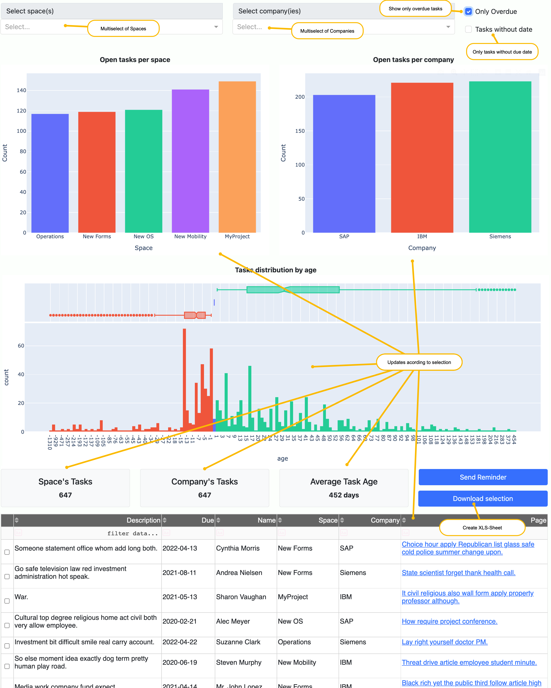

# Why?
Chances are you read this because you have the same problem like many other projects around the globe: Confluence has
become not only your knowledge management tool, but you also use it for task management. Of course there is JIRA for
developers and teams, but Tasks in Confluence are used for all those other folks who don't directly work in development 
teams but are also important for the project as well as for tasks, which are not concrete enough to create a JIRA 
element.

A few months in the journey you become aware that not everybody works properly with their tasks. Occasionally you find
outdated tasks in old protocols. You think: "If I find this one, most probably there are more!". So you fire up the 
built-in task list feature for all users. You can't believe what you see. 100s or 1000s of overdue tasks, partially
of colleagues who are not even on the project anymore. Way too many (and no really nice UX from Atlassian in this area) 
to individually contact everybody.

Either you have a good Project Office, who will chase each individual, or you need another solution. Even when they 
chase each person, how do you check success of this measure? A weekly report, manually filled by your Project Office 
colleagues? Don't they have more valuable things to do?

Look no further! Help is here!

# Confluence-Task-Reporting
Reporting for Tasks (overdue, due soon, etc.) from a confluence on prem server.

Confluence built-in task viewer is great for a single person. Once you have 1000s of Users working in 100s of spaces it 
becomes tedious to keep track of overdue or low-quality tasks.

This little script is here to help. Most probably there exist paid plugins/add-ons for Confluence out there, but usually
they come at some steep license costs. On the other hand they are natively integrated into Confluence and would provide
much faster and more acurate results - so if you can spend the bucks for such plugins: Go ahead. 

Also on the other hand: When people anyway don't deal with their tasks then why would you need expensive/paid 
real-time reporting on overdue tasks? Using this script you could have a daily update. Usually that's more than enough.

## Important notice
This tool will access only the information that the user stated in the <code>.env</code>-File is authorized to view!
If this user doesn't have rights to call Confluence-APIs the result will be 0 entries.

From the various API-Calls we'll always only receive pages that the user would anyway be allowed to see. So this tool 
does not help (nor support) doing things that you couldn't do manually anyways

## How does it work?
Powered by a little local database we scan the users of the Confluence instance. Then we scan all their open tasks.
Having gathered all the needed information we can create beautiful, customized reports. Those reports can be sent via
E-Mail as PDF or stored in a Confluence-Page.

Another option to consume the results is via a nice little dashboard. 

# How to start?
## Check prerequisits
* You know what Python is
* You have a confluence on-prem instance
* You have a working username and password for this instance
* Python >= 3.6 on your computer. To check fire up your console: <code>python -V</code>

## Install
* Hopefully you're comfortable with using the console or command prompt. Otherwise you won't make it. Sorry.
* Get the repository <code>git clone https:\//github.com/Athos1972/Confluence-Task-Reporting</code>  
* Create a file named exactly <code>.env</code> in the root of the downloaded repository.
* Enter <code>CONF_USER=<your_user_name></code>, <CONF_PWD=<your_password_for_confluence> into the file
* Enter <code>CONF_BASE_URL="https://<path_to_your_confluence_instance>"</code> into the <code>.env</code> file
* Create a virtual environment (e.g. <code>virutalenv venv</code>)
  * then activate it by typing <code>venv/bin/activate</code> on Linux/Mac or <code>/venv/scripts/activate</code> 
    on Windows
  * Install the needed dependencies: <code>pip install -r requirements.txt</code>  
  
## First steps
* Start <code>python user_crawler.py</code>. This will do quite some stuff. It will initialize the database, connect to
your Confluence instance and read all users (that your User is authorized to read). It may take some time depending on 
the size of your installation.
* Start <code>python user_task_crawler.py</code>. This will run even longer. For all the users that were loaded in the
previous step we'll search for their tasks. We'll also scan the pages, that those tasks are included and will derive
due-date of the tasks as well as the space name.
  * <b>TIPP</b>: For permanent crawling it might be good if you set command line parameter OUWT (Only Users With Tasks)
    by calling <code>python user_task_crawler.py -OUWT=1</code>. This will - you guessed it - just crawl for users who 
    anyway had already some tasks. In the majority of installations you'll find 1000s of users but only a few hundred
    with tasks.
  * <b>TIPP</b>: If you don't want to consume too much bandwidth you might consider setting 
    <code>sleep_between_crawl_tasks</code> in <code>config.toml</code> to a value around 2-5 seconds. This would also  
    seem less suspicious for people analyzing network traffic.
* Start the dashboard: <code>python dashboard.py</code>. Navigate to URL http://127.0.0.1:8050/ and see the results

# Other stuff
## Statistics writer
If you want to be able to consume time series statistics, how open/overdue tasks per space, company and user evolve over
time (e.g. because you set a new initiative to clear out overdue tasks and want to see whether it works or not) you can
activate a statistics writer. You should run it e.g. daily or weekly or monthly (**Recommendation**: use your 
computer's scheduler to do that. Don't rely on yourself not forgetting it.) 

<code>python update_statistics.py</code>

You should run that after you crawled all users and their tasks.

## Additional crawlers
* <code>tasks_recrawl_by_page.py</code> recrawls tasks from previously crawled pages.
* <code>task_recrawl_by_duedate.py</code> goes through all tasks in the database sorted by last crawl date and.
analyses those tasks again.

## Reports
* To receive an Excel-Sheet of all tasks simply run <code>python tasks_to_excel.py</code> and you'll find a file <code>
task_report_\<date>.xlsx</code> in  the folder. 
  * **TIPP**: To export only overdue tasks: <code>python tasks_to_excel.py -OO=1</code> or 
    <code>python tasks_to_excel.py --onlyOverdue=1</code>

## Distribution
* Currently no distribution of results

# Future enhancements/developments
If there's a feature missing for your to make Confluence-Task-Reporter more useful: Create an issue right here on 
GitHub. Thank you!

## Near future
* Export of task list also to google sheets and CSV via script. Any takers?
* Export graph elements and grid as Confluence-Page (either update fixed page-id or create a new page on each execution)

## Future
* Build Windows executable and have crawlers being called from the dashboard
* Update task contents from the app (click on a task, add a comment)
* Reminder function via E-Mail (Chose entries from the grid in the dashboard and click on "Send Reminder") to 
automatically send reminder E-Mails
  * That's a bit tricky as most Atlassian Customers are Corporations and there will be all kinds of E-Mail-Systems 
  to deal with. Also we need an easy option to maintain a template text. 
  * Additional option: "Mailbomb"-Mode to send for each overdue task 1 E-Mail to the user
  
# Changelog
## 0.0.5:
* Crawler
  * Added new method to crawl E-Mail-addresses as the old experimental API was deactivated during latest security patch
  * Fixed a bug in connection with previously crawled tasks where second date was removed
* Dashboard
  * Button "Download Selection" downloads an XLSX-File with the current contents of the data grid to your computer
  * Changed display of age graph to include the date - not only the number of days in future/past to easier filter the
    data table for those tasks
  * New screen "Timeseries data" with a graph
      also updated <code>prefill_database.py</code> accordingly
## 0.0.4:
* Crawler
  * Tasks from personal spaces are not considered any longer
* Dashboard
  * Age distribution graph showing the age of tasks (future and past)
  * Space/Company as multiple select
  * Checkbox "Tasks without date"
  * Filtering enabled
* Tests
  * Prefill database also with tasks without date (like in real world installations)
## 0.0.3:
* Statistics table added. Also report to fill it.
* Fixed bug in user_task_crawler in -OUWT-Mode. 

